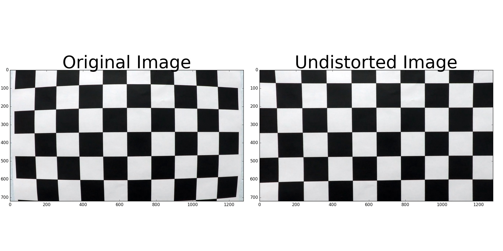
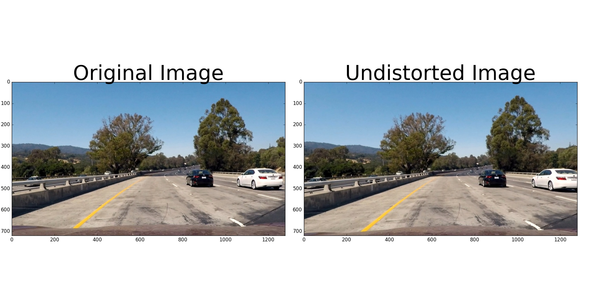
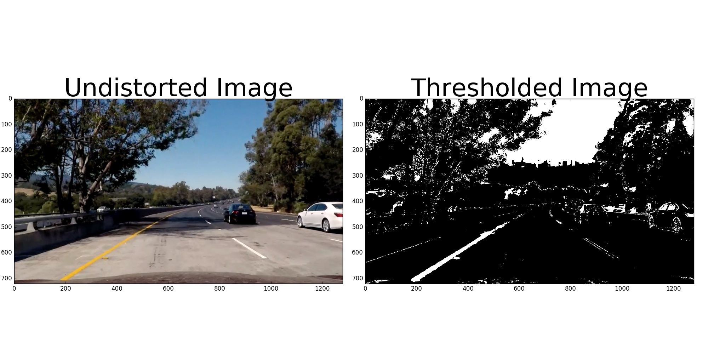
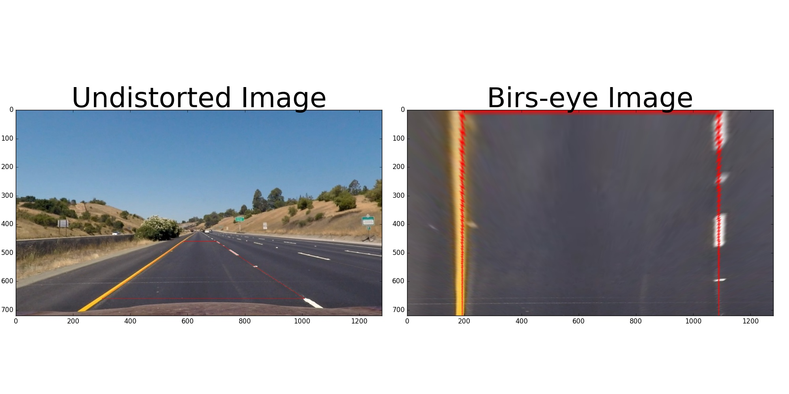
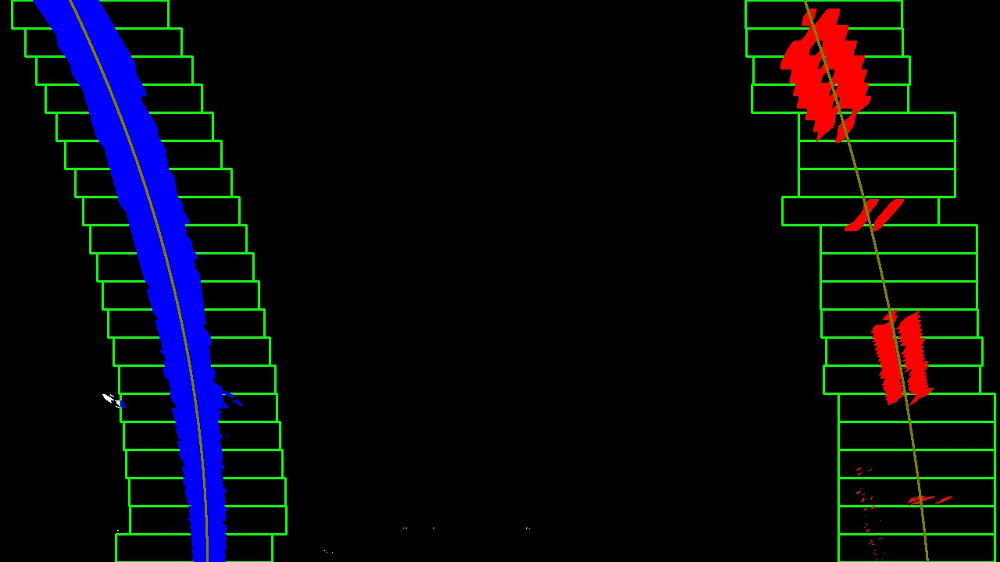
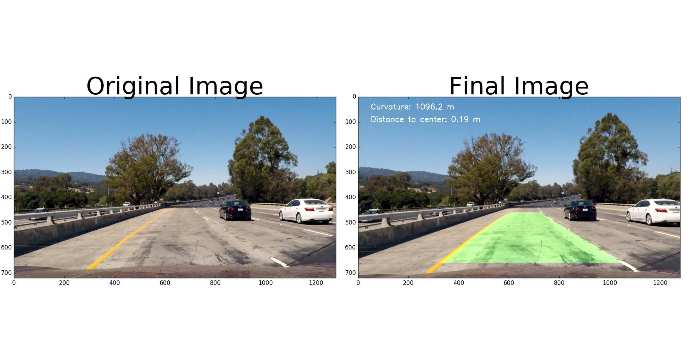

# Advance Lane Finding

## Introduction

The goal of this project is to be able to identify the boundaries of the lane a car is driving in, and to compute the position of the car in the lane.

## The Algorithm

I want to be able to identify the left and right lines of the lane the car is from a video taken from the center of the dashboard. To do that, my algorithm is going to analyze each frame of the video, draw the lane on it and write the curvature of the lane and the position of the car in the lane.

The algorithm I am going to apply to each frame can be divided in the following steps:

* Apply distortion correction to obtain an undistorted image
* Use gradient thresholding to create a binary image
* Transform the undistorted image from RGB to HSV and apply color thresholding to obtain another binary image
* Combine the two thresholded images
* Apply perspective transform to rectify the binary image ("birds-eye view")
* Detect pixels that belong to the lines (either from scratch or by using the lines found in the previous frame)
* Determine the curvature of the lane and the car position with respect to the center of the lane
* Warp the detected lane boundaries back onto the original image

## Camera Calibration

First, I want to calibrate the camera to be able to undistort the images I get from the camera before analyzing it. 

Indeed, because of the lenses of the camera, the pictures it takes represent a distorted view of the reality: distances and shapes might not be represented correctly. 

So, to perform a correct analysis of the image, I first need to undistort it. To do that, I need to know the distortion this particular camera applies to the pictures it takes.

The code for this step is contained in the function `camera_calibration` (lines 9 through 56 of `lane_finding.py`).

I start by preparing "object points", which will be the (x, y, z) coordinates of the chessboard corners in the world. Here I am assuming the chessboard is fixed on the (x, y) plane at z=0, such that the object points are the same for each calibration image. Thus, objp is just a replicated array of coordinates, and objpoints will be appended with a copy of it every time I successfully detect all chessboard corners in a test image. imgpoints will be appended with the (x, y) pixel position of each of the corners in the image plane with each successful chessboard detection (the corner detection is done thanks to the `cv2.findChessboardCorners` function).

I then used the arrays objpoints and imgpoints to compute the camera calibration and distortion coefficients using the `cv2.calibrateCamera` function. I output the camera calibration matrix (`mtx`) and the distortion coefficients (`dist`) that I will use later to undistort images.

Once this is done, I can write the function `undistort_image` (line 58 to 61) that, given an image, the camera calibration matrix and the ditortion coefficients, outputs the undistorted image (this is done thanks to the `cv2.undistort` function). Here are two examples of undistortion (one on a chessboard picture and one on a road picture):





## Thresholding

Once the image has been distorted, I can start analysing it. The goal is to find the pixels in the image that correspond to the lines. 

So, I am going to threshold the image. This means that I am going to eliminate all the pixels that don't satisfy certain conditions  in order to have almost only the lines left on the pictures.

### Gradient Thresholding

The first thresholding will be regarding the gradient: the function `abs_sobel_threshold` (lines 64 to 93) will give back a binary image where only the pixels where the gradient in one direction (`orient`) is in a certain range (`abs_thresh`) will be nonzero.

I start by converting the image to grayscale and taking the gradient in the specified direction using `cv2.Sobel`. Then I take the absolute value and scale this gradient so that it is in the range (0,255). Finally, I create an empty binary image of the same size and set the pixels to 1 only if the scaled gradient is in the specified range:

	s_bin = np.zeros_like(scaled_sobel)
	s_bin[(scaled_sobel>=abs_thresh[0]) & (scaled_sobel<=abs_thresh[1])] = 1
	
### Color Thresholding

The second thresholding will be regarding the color. But it will not be in the RGB color space: I am going to threshold the S and V channels in the HSV color space (Hue-Saturation-Value). The function `color_threshold` (lines 140 to 162) will output a binary image where only the pixels where the H, S and V channels are in a certain range (`ch1_thresh`, `ch2_thresh`, `ch3_thresh`) will be nonzero.

I start by converting the image to the specified color space using `cv2.cvtColor`. Then I separate the 3 color channels. Finally, I create an empty binary image of the same size and set the pixels to 1 only if the 3 color channels are in the specified ranges:

	color_bin = np.zeros_like(ch1).astype(np.uint8)
	color_bin[(ch1>=ch1_thresh[0]) & (ch2>=ch2_thresh[0]) & (ch3>=ch3_thresh[0]) & \
			  (ch1<=ch1_thresh[1]) & (ch2<=ch2_thresh[1]) & (ch3<=ch3_thresh[1])] = 1				  			  
```

### Combining the two thresholding

Now I want to combine this two thresholding. The function `combines_threshold` (lines 164 to 183) will output a binary image where the only nonzero pixels are those that satisfy:

* Scaled gradient in the x direction and in the y direction are above 25
* OR the S and V channels are above 80

Here is an example of the result:



## Perspective Transform

Now that I have obtained binary images where almost only the lines are nonzero pixels, I want to clearly identify the lines. To make this identification easier, I am first going to change the perspective: I want to have a view of the road from above instead of from the center of the windshield.

To perform this change of perspective, I first need to compute the transition matrix. I am also computing the inverse of this matrix to be able to come back from an above view to a windshield view.

To compute these matrices, I need to map 4 points on the original (undistorted) image to 4 new points. Since I want to find the lines on the road, I chose to map a trapezoidal region on the original image to a rectangular region on the new image. I picked the coordinates of the 4 corners of the trapezoidal region on the 2 test images `straight_lines1.jpg` and `straight_lines2.jpg` after I applied undistortion (I chose not to include the hood of the car in this region).

| Source        | Destination   | 
|:-------------:|:-------------:| 
| 584, 460      | 192, 0        | 
| 700, 460      | 1088, 0       |
| 1008, 660     | 1088, 720     |
| 300, 660      | 192, 720      |

The matrices M (transformation matrix to go from dashboard view to birds-eye view) and Minv (transformation matrix to go from birds-eye view to dashboard view) are computed in the function `get_perspective_matrices` (line 185 to 227) using the function `cv2.getPerspectiveTransform`.

Once this is done, I can write the function `change_perspective` (line 229 to 232) that, given an image and a transformation matrix, outputs the warped image (this is done thanks to the `cv2.warpPerspective` function). Here is an example of a change of perspective (I drew the trapezoidal region and the rectangular region on this example):



## Lane Detection

Now that I have undistorted the image, thresholded it and change my perspective to an above view, I can look for the lines. There are two ways to look for the lines. Either you have no idea where they are, or you do and can look arround where you think they are. 

### Lane Detection from scratch

First let's implement a function that searches for the lines not knowing where they might be. This is done in the function `find_lane_from_scratch` (line 234 to 317). 

I start by using a histogram to look for the starting point of the lines:

	histogram = np.sum(image[y_shape/2:,:], axis=0)

	mid_point = np.int(histogram.shape[0]/2)
	x_left = np.argmax(histogram[:mid_point])
	x_right = np.argmax(histogram[mid_point:]) + mid_point

Then apply a sliding window method to determine the pixels belonging to the lines:

* I define a rectangular window arround the position of the line
* I detect the nonzero pixels in this window
* If I detected enough nonzero pixels (more than 50 here), I define the new position of the line (and so the center of the next window) to be the average position of the nonzero pixels found

Once that I know the pixels corresponding to the lines, I can fit a 2nd degree polynomial through these pixels to have a smooth line. This is done in the function `fit_poly` (line 319 to 321). Here is an example of the result:



### Lane Detection from previous lane

When analysing a video frame by frame, to gain some time, I am not going in each frame to try to find the lines from scratch. I am going to use the position of the lines in the previous frame to find them in this frame.

To do that I use the function `find_lane_from_previous` (line 327 to 368):

* I start by fitting polynomial through the previous lane pixels
	
		left_fit = fit_poly(previous_lane[0])
		right_fit = fit_poly(previous_lane[1])
		
* Then, I simply detect the nonzero pixels arround these two lines


### Combining the two approaches

The question now is to know when to use the lines of the previous frame to find the lines in this frame and when to try to find them from scratch. For that, I am going to check if the lines already found are correct. This check is in 3 parts:

* First I check that the right and left lines have approximatively the same curvature
* Then I check that they are parallel
* Finally, I check that the lane is wide of about 3.7 meters.

This is check is done in the function `check_lane_sanity` (line 435 to 457).

Once I know how to check if the lines I found are correct or not, I can define my final algorithm to find the lane in a frame. This is done in the function `detect_lane` (line 487 to 510). First, I check the probability that the lane found in the previous frame is correct. If it is, I look for the lane in this frame using `find_lane_from_previous`. Otherwise, I look for the lane in this frame using `find_lane_from_scratch`:

	if previous_proba > proba_thresh:
		lane = find_lane_from_previous(image, previous_lane)
	else:
		lane = find_lane_from_scratch(image)
		
Now that I found a lane, I want to know if I keep it or if I discard it. I discard it only if the previous lane had a probability above 50% and this lane has a probability under 50%. In this case, I discard the lane I just found, use the previous lane and move on to the next frame:

	if previous_proba > proba_thresh and current_proba <= proba_thresh:
		return previous_lane, current_proba
	else:
		return lane, current_proba
		
## Drawing the lane

Now that I know where the lane boundaries are, I want to draw the lane on the original (undistorted) image. To do that I use the function `draw_lane_smooth` (line 553 to 597):

* First, I am creating an empty image where I am going to draw the lane from a birds-eye view.

		warp_zero = np.zeros_like(bin_image).astype(np.uint8)
		color_warp = np.dstack((warp_zero, warp_zero, warp_zero))
		
* Then I am going to add to my left and right lines, the previous 5 left and right lines. This will avoid having jittery lines on the final video.

		for pr_lane in previous_lanes:
			left_line = np.append(left_line,pr_lane[0], axis=1)
			right_line = np.append(right_line,pr_lane[1], axis=1)
			
* Then I fit a 2nd degree polynomial through each line and fill the area between them (the lane) in green

		cv2.fillPoly(color_warp, np.int_([pts]), (0,255, 0))
		
* I take this image and change the perspective to go back to a dashboard view

		driver_perspective = change_perspective(color_warp, Minv)
		
* I can now add this colored lane to the original undistorted image

		final_image = cv2.addWeighted(undist_image, 1, driver_perspective, 0.3, 0)

* Finally, I write the curvature and distance of the car to the center of the lane onto this image

		cv2.putText(final_image, 'Curvature: '+str(curv)+' m', (50,50), cv2.FONT_HERSHEY_SIMPLEX, 1, (255,255,255), 2)
		cv2.putText(final_image, 'Distance to center: '+str(dist_to_center)+' m', (50,100), cv2.FONT_HERSHEY_SIMPLEX, 1, (255,255,255), 2)

Here is an example of the final result:



## Processing the Video

Once the entire algorithm is done, I just need to apply it to the video frame by frame, updating my parameters (the list of previous lanes found and the probability the previous lane is correct) at each frame. I do that in the function `process_video` (line 616 to 639). Here is the result on the project video:

<video controls>
  <source src="project_video_out.mp4" type="video/mp4">
</video>  


## Reflection

By trying this algorithm on different test images and videos, I can see that it is highly dependent on the parameters I used (it took a lot of time to test parameters and find the one I used):

* The zone of interest in changing the perspective (offset, corners)
* The gradient and color thresholds and the color space
* The checks I use to discard a line and the threshold

This dependency means that the algorithm may fail in other driving conditions (different luminosity due to bad weather or night for example).  This could be improved by testing other thresholding and maybe adapting the thresholding method to the light condition.

Another way to improve the algorithm would be to remember the previous lane found, and compute what should be the lane now given the previous lane and the movement of the car (that can be deduced from the speed, steering, throttle ...).

Finally, this algorithm assumes that the car is in the lane (it looks for a line on the left side and one on the right side). So it will fail when changing lane.